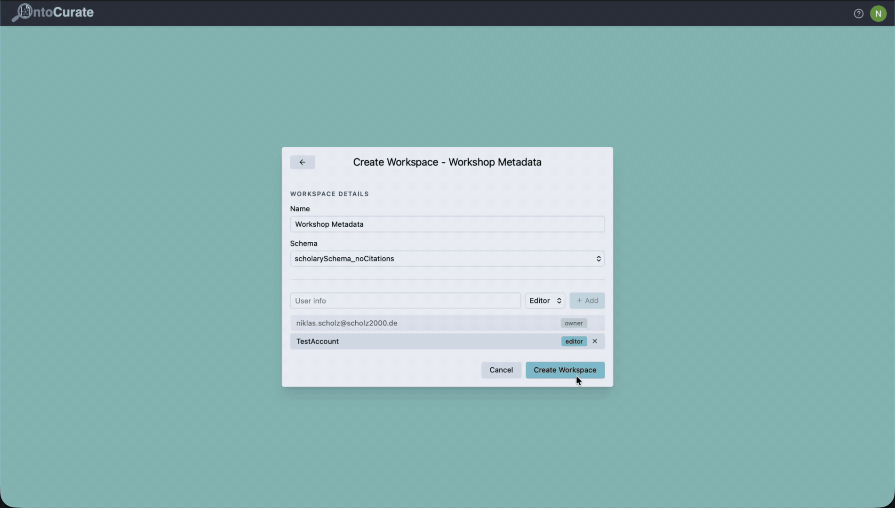

## Table of Contents

- [About](#about)
- [How to install](#how-to-install)
- [How to deploy to production environments](#deployment-production)
- [Documentation](#documentation)
- [Extending the Application](#extending-the-application)
    - [Onboarding a new schema](#onboarding-a-new-schema)
    - [Onboarding a new pipeline strategy](#onboarding-new-pipeline-strategies)
- [Development Practices](#development-practices)
  - [Pre-commit hooks](#pre-commit-hooks)
  - [Running tests](#testing)
- [Acknowledgements](#acknowledgements)

## About
OntoCurate is a schema-agnostic ontology-guided knowledge graph extraction and curation tool following a human-in-the-loop approach. We use [OntoGPT](https://github.com/monarch-initiative/ontogpt)'s SPIRES method to prompt LLMs into extracting ontology-guided structured triples from documents. Additionally, the system performs entity alignment and linkage to external knowledge bases (ORCID, Wikidata). 

 The application offers curators a collaborative review workflow to accept, reject, or edit each individual triple before it becomes part of the final data knowledge graph of the workspace. The final KGs can be accessed further through a provided query view or through (deduplicated) exports in various formats. For audit purposes curation activities are stored in an additional provenance graph available to workspace owners.




## How to install

**Local Prerequisites:** Docker, Python 3.12+, Node.js 20+ with npm

### 1. Clone the repository

```bash
git clone https://git.rwth-aachen.de/i5/teaching/kglab/ss2026/onto-curate.git
cd onto-curate
```

### 2. Add secrets credentials

```bash
cp backend/secrets.env.example backend/secrets.env
cp frontend/.env.example frontend/.env
```

Open `backend/secrets.env` and `frontend/.env` and fill in the required values (`VITE_GOOGLE_CLIENT_ID` in `frontend/.env` should match the Google client ID set in `backend/secrets.env`). The Google Client ID refers to the client id provided by OAuth2 authentication via the Google Cloud Console. 

### 3. Start the application

```bash
docker compose up --build
```

This starts the following services accessible in your local environment for testing and development:

| Service          | URL |
|------------------|---|
| Frontend         | http://localhost:5173 |
| Backend API      | http://localhost:8000 |
| API Swagger Page | http://localhost:8000/docs |


---

## Deployment (production)

Run `docker compose -f docker-compose.prod.yml up --build -d` to deploy the production image, which switches to a non-root backend and a static frontend. Set `ENVIRONMENT=production` in `backend/secrets.env`, so no user can access the swagger page and authentication cookies become secure. Additionally, add a real `SECRET_KEY`, and the correct `CORS_ALLOW_ORIGINS` based on your deployment to the secrets file.

In the production environment users have no way of accessing Oxigraph, Postgres or Redis without being directed through and authenticated on the FastAPI layer. 

## Documentation

- [`.docs/adr-log/`](.docs/adr-log) list our architecture decision records.
- [`.docs/technical-logic-documentation/`](.docs/technical-logic-documentation) documents the complex parts of our pipeline. Refer to these when tuning thresholds/weights or onboarding a new schema. 
- [`.docs/ontologies/`](.docs/ontologies) documents the definition our provenance ontology *paco*. 
- [`backend/config/`](backend/config/) lists all LinkML ontology schemas currently available within our web application, as well as their corresponding config files.

---

## Extending the Application

### Onboarding a new schema

A schema is a folder under `backend/config/<schema_name>/` containing exactly four files: `extraction_schema.yaml` (a LinkML ontology defining the classes/slots the LLM extracts, e.g. `Person`, `AcademicArticle`), `provenance_config.yaml` (confidence-scoring and text-span-matching settings), `alignment_config.yaml` (similarity thresholds/weights used to propose duplicate-entity alignments), `lookup_config.yaml` (settings for the lookup services). Once all four files are present, the folder name automatically becomes selectable in the workspace-creation UI and can be used by users. 

### Onboarding new pipeline strategies

To onboard new provenance or alignment strategies, add respective functions to the entry points of provenance annotation, entity alignment or lookup. The schema-agnostic architecture of ontoCurate enables onboarding without having to change logic for already onboarded schemas utilizing distinct keys for new strategies. 

## Development Practices
### Pre-commit hooks

We use pre-commit to enforce code formatting before every commit. Install it once after cloning:

```bash
pip install pre-commit
pre-commit install
```

Afterwards, the following checks run automatically on `git commit` ensuring that the CI/CD pipeline does not fail on linting:

- **autoflake**: removes unused imports
- **isort**: sorts Python imports
- **black**: formats Python code
- **eslint**: lints frontend TypeScript/React files


### Testing 

We test all components of our backend, which do not require heavy mocking, using `pytest`. 
 

**Setup for Running Tests locally:**
```bash
cd backend
pip install -e ".[dev]"
pytest tests/ -v
```

---

## Acknowledgements

Our Ontology-guided triple extraction is built around [OntoGPT](https://github.com/monarch-initiative/ontogpt):

> [1] Caufield, J. H., Hegde, H., Emonet, V ., Harris, N. L., Joachimiak, M. P ., Matentzoglu, N., Kim, H., Moxon, S. A. T., Reese, J. T., Haendel, M. A., Robinson, P . N.& Mungall, C. J. (2026). OntoGPT (Version v1.1.1) [Computer software]. Zenodo. https://doi.org/10.5281/zenodo.19446792