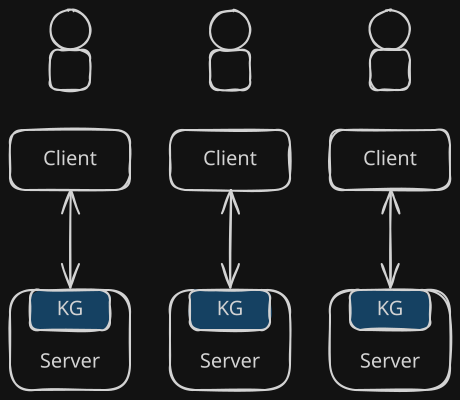
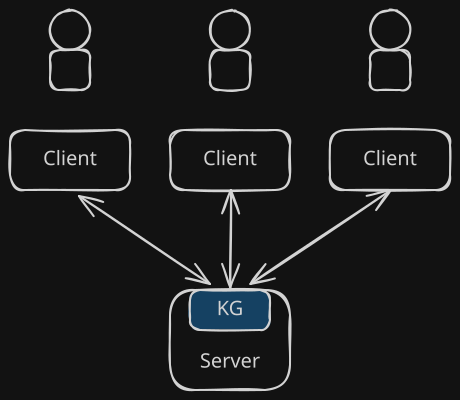
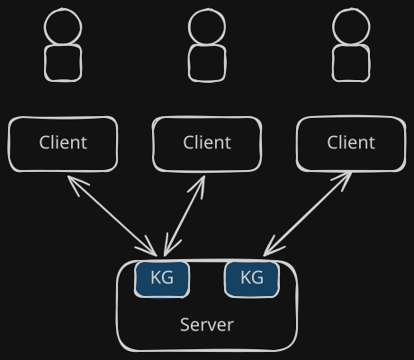
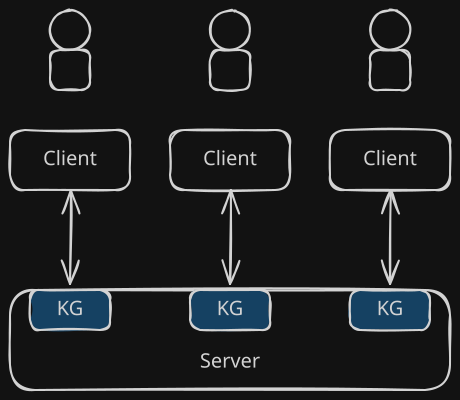

# Use a multi-user collaboration concept with multiple shared workspaces

## Context and Problem Statement

The requirements document does not make the overall flow of the web application explicit. Specifically, it is unclear whether and how users will be able to collaborate on knowledge graphs.

## Considered Options

(1) Single-user application: The most straightforward; behaves like an Electron app.

(2) Single-user webapp: Shared server but with segregated state for each client.

(3) Collaborative with global knowledge graph: All users interact with the same knowledge graph.

(4) Collaborative with multiple workspaces: All users interact with the same, shared state, but that state is separated into multiple segregated knowledge graphs (termed "workspaces"), allowing users to choose whether and with whom to collaborate.

## Decision Outcome

We ultimately aim for option (4). While it is the most complicated to implement, we do not anticipate that the required logic for this will be particularly challenging. If collaboration is nevertheless found to be unfeasible, we may retreat to option (2).

### Consequences

* This decision impacts further architectural questions such as the design of API routes.
* Allowing collaboration may cause more conceptual challenges in how to resolve conflicts, as well as implementation challenges such as making the application properly thread-safe.
